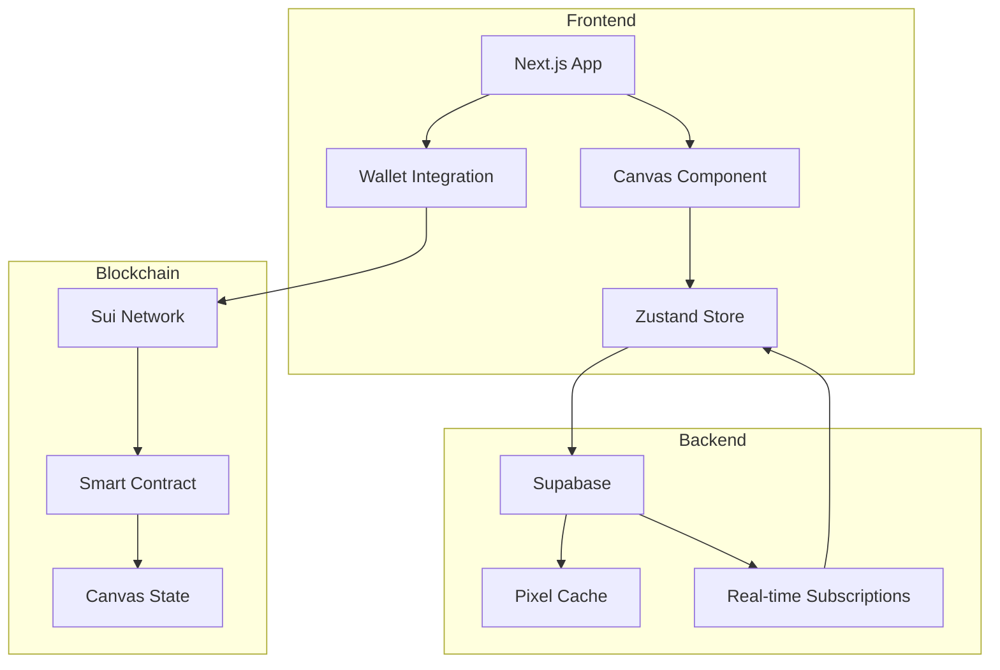
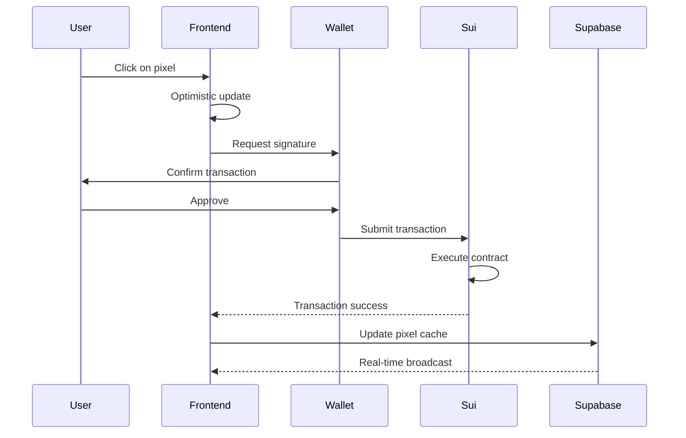
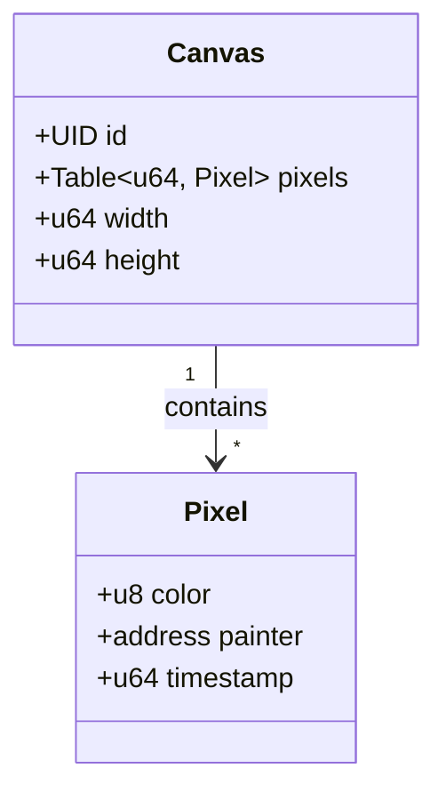
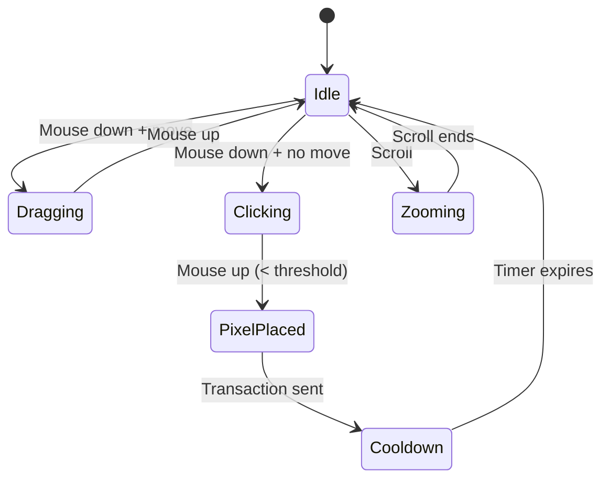
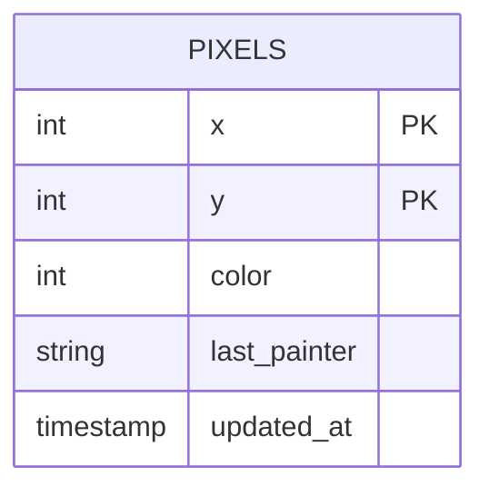

# SuiPlace

A decentralized collaborative pixel art canvas built on the Sui blockchain. Inspired by Reddit's r/place, SuiPlace allows users to place pixels on a shared canvas where every pixel is recorded on-chain.

## Overview

SuiPlace is a web3 application that combines the social experiment of collaborative pixel art with blockchain technology. Users connect their Sui wallet, select a color, and place pixels on a 50x50 canvas. Each pixel placement is a transaction on the Sui blockchain, ensuring transparency and permanence.

## Architecture



## Data Flow



## Tech Stack

| Layer | Technology |
|-------|------------|
| Frontend | Next.js 16, React, TypeScript |
| Styling | Tailwind CSS |
| State Management | Zustand |
| Blockchain | Sui Network |
| Wallet | @mysten/dapp-kit |
| Database | Supabase (PostgreSQL) |
| Deployment | Vercel |

## Project Structure

```
sui-place/
├── frontend/
│   ├── src/
│   │   ├── app/
│   │   │   ├── page.tsx          # Landing page
│   │   │   ├── game/
│   │   │   │   └── page.tsx      # Game page
│   │   │   └── layout.tsx        # Root layout
│   │   ├── components/
│   │   │   ├── Canvas.tsx        # Main canvas component
│   │   │   ├── ColorPicker.tsx   # Color selection
│   │   │   ├── PixelInfo.tsx     # Pixel details display
│   │   │   ├── PixelBlast.tsx    # Background animation
│   │   │   ├── WalletButton.tsx  # Wallet connection
│   │   │   ├── CooldownTimer.tsx # Cooldown display
│   │   │   └── Providers.tsx     # Context providers
│   │   └── lib/
│   │       ├── store.ts          # Zustand state
│   │       ├── sui.ts            # Sui transaction helpers
│   │       ├── supabase.ts       # Database client
│   │       └── constants.ts      # Configuration
│   ├── public/
│   │   └── suiplace.ico          # Favicon
│   └── package.json
├── contracts/
│   └── sources/
│       └── suiplace.move         # Move smart contract
└── README.md
```

## Smart Contract

The Move smart contract manages the canvas state on Sui:



### Contract Functions

- `create_canvas()` - Initialize a new canvas
- `draw(canvas, x, y, color)` - Place a pixel at coordinates

## Features

- **Real-time Canvas**: See other users' pixels appear instantly
- **Wallet Integration**: Connect with Sui-compatible wallets
- **Cooldown System**: Rate limiting to prevent spam
- **Pixel History**: Track who placed each pixel
- **Responsive Design**: Works on desktop and mobile
- **Interactive Landing**: Animated background with click effects

## Canvas Interaction



## Getting Started

### Prerequisites

- Node.js 18+
- npm or yarn
- Sui wallet (Sui Wallet, Suiet, etc.)

### Installation

```bash
# Clone the repository
git clone https://github.com/yourusername/sui-place.git
cd sui-place

# Install frontend dependencies
cd frontend
npm install

# Set up environment variables
cp .env.example .env.local
# Edit .env.local with your Supabase credentials
```

### Environment Variables

```env
NEXT_PUBLIC_SUPABASE_URL=your_supabase_url
NEXT_PUBLIC_SUPABASE_ANON_KEY=your_supabase_anon_key
NEXT_PUBLIC_PACKAGE_ID=your_deployed_contract_package_id
NEXT_PUBLIC_CANVAS_ID=your_canvas_object_id
```

### Development

```bash
# Start development server
npm run dev

# Build for production
npm run build

# Start production server
npm start
```

### Smart Contract Deployment

```bash
cd contracts

# Build the contract
sui move build

# Deploy to testnet
sui client publish --gas-budget 100000000
```

## Color Palette

The canvas supports 16 colors:

| Index | Color | Hex |
|-------|-------|-----|
| 0 | White | #FFFFFF |
| 1 | Light Gray | #E4E4E4 |
| 2 | Dark Gray | #888888 |
| 3 | Black | #222222 |
| 4 | Pink | #FFA7D1 |
| 5 | Red | #E50000 |
| 6 | Orange | #E59500 |
| 7 | Brown | #A06A42 |
| 8 | Yellow | #E5D900 |
| 9 | Lime | #94E044 |
| 10 | Green | #02BE01 |
| 11 | Cyan | #00D3DD |
| 12 | Blue | #0083C7 |
| 13 | Dark Blue | #0000EA |
| 14 | Purple | #CF6EE4 |
| 15 | Dark Purple | #820080 |

## Database Schema



## Performance

- Canvas uses HTML5 Canvas for efficient rendering
- Pixels are cached in Supabase for fast initial load
- Real-time updates via Supabase subscriptions
- Optimistic UI updates for instant feedback

## Security

- All pixel placements require wallet signature
- Rate limiting via cooldown mechanism
- On-chain verification of all transactions

## Network

Currently deployed on Sui Testnet. Mainnet deployment planned after testing phase.

## Contributing

Contributions are welcome! Please open an issue or submit a pull request.

## License

MIT License

## Links

- [Sui Documentation](https://docs.sui.io/)
- [Supabase Documentation](https://supabase.com/docs)
- [Next.js Documentation](https://nextjs.org/docs)
